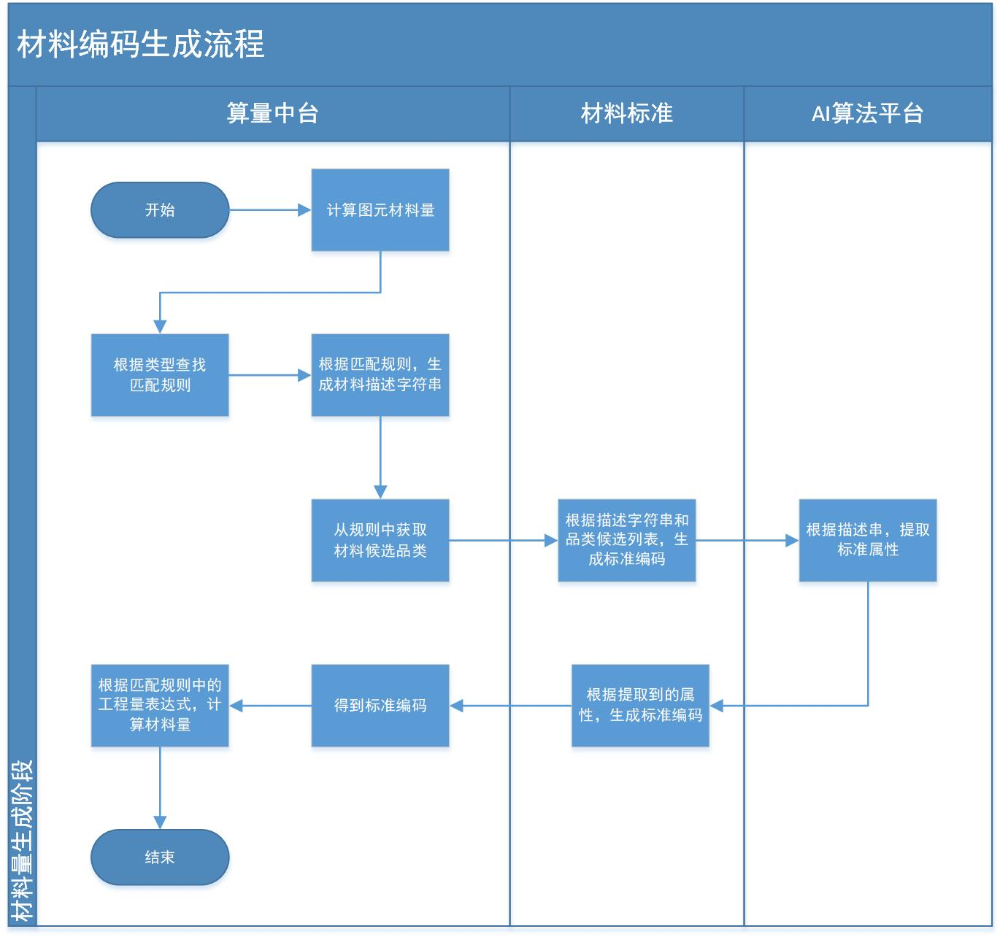
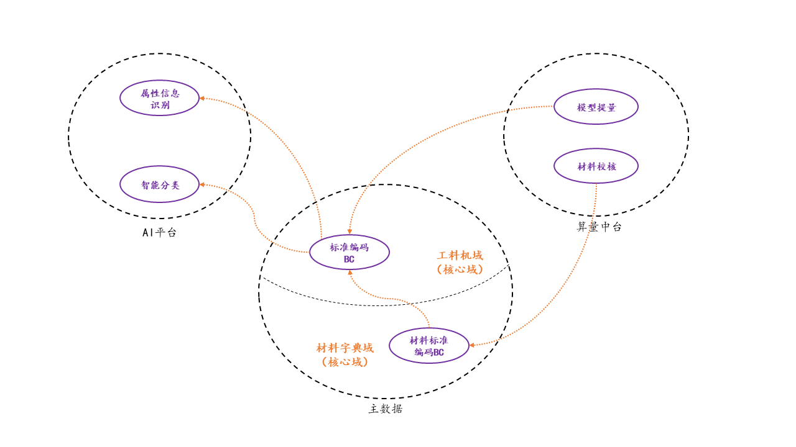
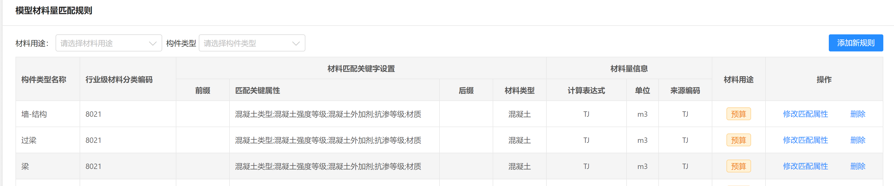
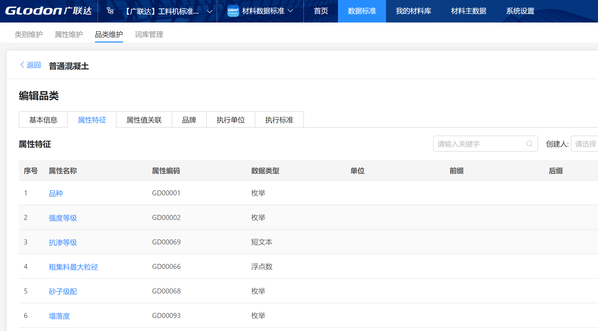

# 模型材料量提取开发说明文档

## 总体流程

## 限界上下文

## 边界划分
边界划分是为了更好的明确各个系统之间的职责，具体如下

### 算量中台
1. 模型材料匹配规则的维护

2. 图元中材料属性的提取
3. 图元中材料工程量的计算

### 主数据-标准编码
1. 标准编码的维护

2. 提供统一的生成标准编码的能力

### 主数据-材料字典
1. 提供企业及项目下材料字典的维护能力
2. 能够根据标准编码，检索到与之对应的材料字典

### AI 算法平台

1. 基于材料描述字符串，利用AI的能力，识别出材料所属的品类
2. 基于材料描述字符串，利用属性提取规则，从材料描述字符串中，提取出材料的属性

